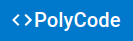

<br />
<div align="center">
  <a href="https://ascoz.fr">
    
  </a>

  <h3 align="center">A small coding learning app</h3>

  <p align="center">
    <a href="https://ascoz.fr">View website</a>
  </p>
</div>

## À propos du projet

Ce projet a été réalisé dans le cadre d'un cours de développement web.\
Il consiste à créer un site web permettant de s'exercer sur la programmation, en suivant des exercices définis.\
Cette partie ne concerne que le rendu visuel du site. [Voir le back-end](https://github.com/Alexis-Bernard/polycode_backend)

### Technologies utilisées

* [React.js](https://reactjs.org/)
* [React Router](https://reacttraining.com/)
* [React Hook Form](https://react-hook-form.com/)
* [MUI](https://material-ui.com/)
* [Axios hook](https://www.npmjs.com/package/axios-hooks)
* [React ACE Editor](https://github.com/securingsincity/react-ace)

## Installation

1. Clonez le projet sur votre machine.
   ```sh
   git clone https://github.com/Alexis-Bernard/polycode_frontend.git
   ```
2. Installez les dépendances.
   ```sh
   npm install
   ```

## Utilisation

Dans le dossier du projet, vous pouvez exécuter:

### `npm start`

Exécute le serveur web en mode développement.\
Ouvrez [http://localhost:3000](http://localhost:3000) dans votre navigateur pour s'y connecter.

La page se rechargera automatiquement à chaque modification du code.

### `npm run build`

Build le site web dans le dosser `build` pour la production.
Votre application est prête à être déployée !